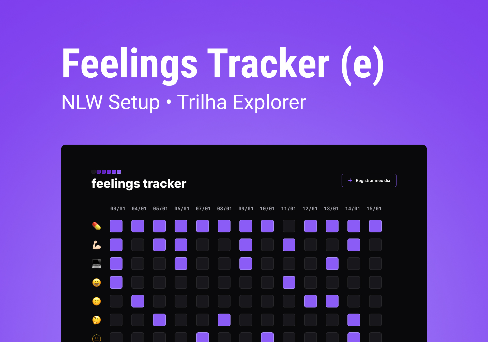

<h1 align="center"> Feelings Tracker </h1>

Você sabia que seus hábitos têm relação direta com seus sentimentos/sensações?  

  <a href="#-tecnologias">Tecnologias utilizadas</a>&nbsp;&nbsp;&nbsp;|&nbsp;&nbsp;&nbsp;
  <a href="#-projeto">Projeto</a>&nbsp;&nbsp;&nbsp;|&nbsp;&nbsp;&nbsp;
  <a href="#-layout">Layout</a>&nbsp;&nbsp;&nbsp;|&nbsp;&nbsp;&nbsp;
  <a href="#memo-licença">Licença</a>

  

 

  

## 🚀 Tecnologias utilizadas

Esse projeto foi desenvolvido com as seguintes tecnologias:

- HTML e CSS
- JavaScript
- Git e Github
- Figma

## 💻 Projeto

O Feelings Tracker é um app para ajudar pessoas com depressão a rastrear os seus sentimentos diários e relacioná-los a alguns de seus hábitos.

- [Visite o projeto online](https://gabrielacvcnt.github.io/nlw-setup)

## 🔖 Layout

Você pode visualizar o layout do projeto através [DESSE LINK](https://www.figma.com/file/Ylu94ydmq0uv1cut0KLILd/Feelings-Tracker-(Community)?t=jLp2oDJ4o1cKzO5N-6). É necessário ter conta no [Figma](https://figma.com) para acessá-lo.

## :memo: Licença

Esse projeto está sob a licença MIT.

---

Feito com ♥ by Rocketseat&Gabi (personalização) :wave: [Participe da nossa comunidade!](https://discord.gg/rocketseat)
